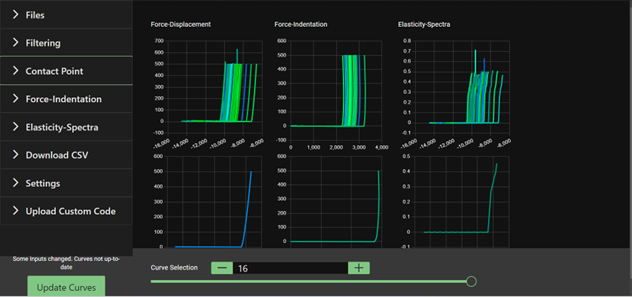
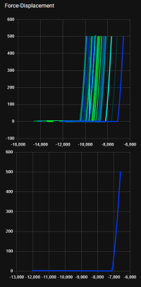
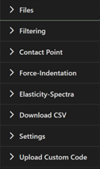

# Development of an online open data workflow for mechanical analysis of soft biomaterials

This is a web-driven application organised as a workflow, that will assist scientists in analysing the results from nano-indentation experiments, to understand the interaction between cells and materials.

Our implementation was based on the GUI created by Prof. Massimo Vassalli et.al, explained in the following paper.

Ciccone, G., Azevedo Gonzalez Oliva, M., Antonovaite, N., Lüchtefeld, I., Salmeron-Sanchez, M. and Vassalli, M., 2021. Experimental and data analysis workflow for soft matter nanoindentation. Journal of Visualized Experiments (10.3791/63401 ).

# Status

The website is able to take in experiment data from a Txt or JPK-Force-Map file and display it in a set of graphs.

You can apply a set of filters to the data (which can be stacked) and calculate the contact point and the indentation.

Once you are done, you can download the graphs and the workspace (the values you set for all the filters and so on).

# Installation and Building

### 1.-Install NodeJS

You can download the executable through the website: https://nodejs.org/en/download/. For Windows, we recommend installing the .mpi file and for MacOS, the .pkg. For Linux OS, 
Node.js has a guide for each Linux distribution1: https://github.com/nodesource/distributions/blob/master/README.md. 

Run the executable to start the installation process.

After that is finished, you can run the following commands in the terminal to check that the installation has been successful.

To check the node version:
```console
foo@bar:~$ Node -v
v14.15.0
```

To check the npm version:

```console
foo@bar:~$ npm -v
6.14.8
```

If you already have Node.js installed, you can update it with the following terminal command:

```console
foo@bar:~$ npm install -g npm@latest
```

### 2.- Install Angular 15 CLI

You can use the Angular client to aid with the installation.
```console
foo@bar:~$ npm install -g @angular/cli@15
```

### 3.- Install remaining dependencies
There is a package.json file that holds the dependencies used. To install them, navigate to the folder /ese2-main/nanoindentation-dashboard/ and run npm install.

```console
foo@bar:~$ cd /ese2-main/nanoindentation-dashboard/
foo@bar:~$ npm install
```

### 4.- Build application

To build and serve the application:
```console
foo@bar:~$ ng serve
```
The page can be visited on http://localhost:4200/.

### 5.- Run Backend

The backend is built on Flask and is used for the AFMFormats library. 
The AFMFormats library is a Python library for reading atomic force microscopy (AFM) data file formats which can come in the form of a jpk-force-map. Jpk-force-map files are large data files usually created by machines in atomic force microscopy. These files can be very large and require an external library to parse. More about afmformats can be read here: https://afmformats.readthedocs.io/en/stable/

To install these, a tutorial can be found here: https://docs.python.org/3/installing/index.html.

```console
foo@bar:~$ cd /ese2-main/
foo@bar:~$ pip install flask flask-cors afmformats
```

Run the Server.py file in the root directory of the project. This will enable the backend which is required for the processing of AFMFormats.

```console
foo@bar:~$ python server.py
```

# Visuals and Usage
This is what you will see after building the application.



## Graphs
Three sets of graphs are displayed, each with a primary and secondary graph. The primary graph displays all of the uploaded curves, whearas the secondary graph displays one curve from the set, picked out by a slider on the sidebar.



## Sidebar
The interface is the sidebar will allow you to control the data shown in the graphs. Is made up of 8 parts which consist of drop-down tabs. 



### 1. - Files
Files shows and gives the options to select which uploaded file/s to show in the graphs. There are also buttons to upload either text or jpk-force-map files which will automatically shown in the graphs as well as in the "Select file to use" box. 
There is a drop down menu that allows the user to activate filters. Multiple filters can be selected, and they will apply to all graphs.

### 2.- Filtering
Filtering lets you search and select for the preset filters that can be applied to the uploaded datasets and viewed in the graphs.

### 3.- Contact Point
The Contact Point tab defines which contact point calculation method wish to use including an auto range. Contact point is the point at which the cantilever made contact with the surface.

### 4.- Force-Ind
The Force-Ind tab is used to control the second set of graphs - the Force-Indentation graphs. The feature is a drop down box which allows the user to select a spring constant from a range. 
There is also a toggle to choose to set "Zero Force"

### 5.- Elasticity-Spectra
The Elasticity-Spectra tab is used to control the third set of graphs. The type of Tip geometry can be selected, The user can also choose the settings for the values for "Radius", "Win" and "Order" as well as toggle the option to use "Interpolation".

### 6.- Download CSV
This is a drop-down feature which allows the user to download the datasets of either the "Force Displacement", "Force Indentation" or "Elasticity Spectra" and choose to either download the entire datasets or a single curve.

### 7.- Settings
This is a drop-down feature which allows the user to download the settings they have selected for the displayed datasets as a text file or to upload their own desired settings 

### 8.- Upload Custom Code 
This enables the user to upload their own custom filter or CPoint python code file 

### Curve Selection
This is a curve selection slider feature on the bottom bar which gives the user the option of easily selecting a single curve or looking through the single curves from the entire dataset with will automatically displayed on the bottom graphs. 

### Update Curves
When a change is made to any of the filters or selections then a button called "Update Curves" will appear allowing the graphs to apply any changes made to the displayed graphs 

# Support
This project will not be maintained by the contributors to this repository. If there are any issues with the installation process, please contact any of the team members via email.

# Team Organisation
### Team Members

- **Alex Markopoulou** -    2550454m@student.gla.ac.uk
- **Raphael Nekam** - 2575686n@student.gla.ac.uk

- **Kyle Watt** - 2555811w@student.gla.ac.uk

- **Marina San Jose Pena** - 2569221s@student.gla.ac.uk

- **Djan Tanova** - 2542341t@student.gla.ac.uk

- **Anthony Rainey** - 2506467r@student.gla.ac.uk

- **Alexander Lake** - 2576885l@student.gla.ac.uk
***
### Team Coach
- **Tim Storer** - Timothy.Storer@glasgow.ac.uk

# License
This project operates under the MIT license. This is an open-source license.
