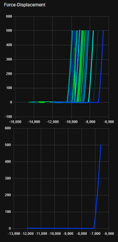
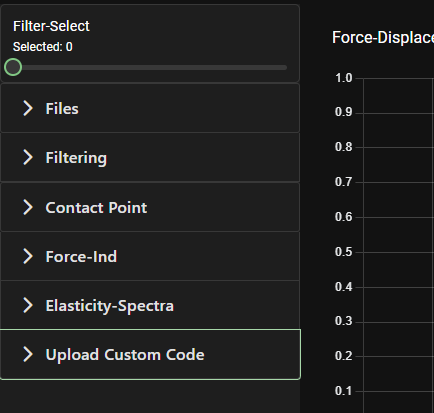
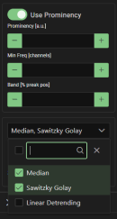

# Development of an online open data workflow for mechanical analysis of soft biomaterials

This is a web-driven application organised as a workflow, that will assist scientists in analysing the results from nano-indentation experiments, to understand the interaction between cells and materials.

Our implementation was based on the GUI created by Prof. Massimo Vassalli et.al, explained in the following paper.

Ciccone, G., Azevedo Gonzalez Oliva, M., Antonovaite, N., Lüchtefeld, I., Salmeron-Sanchez, M. and Vassalli, M., 2021. Experimental and data analysis workflow for soft matter nanoindentation. Journal of Visualized Experiments (10.3791/63401 ).

# Status

When built, the website is able to take in experiment data and apply a set of filters to the data, calculate the contact point and the indentation and apply emodels and fmodels.

# Team Organisation
### Team Members

- **Alex Markopoulou** -    2550454m@student.gla.ac.uk
- **Raphael Nekam** - 2575686n@student.gla.ac.uk

- **Kyle Watt** - 2555811w@student.gla.ac.uk

- **Marina San Jose Pena** - 2569221s@student.gla.ac.uk

- **Djan Tanova** - 2542341t@student.gla.ac.uk

- **Anthony Rainey** - 2506467r@student.gla.ac.uk

- **Alexander Lake** - 2576885l@student.gla.ac.uk
***
### Team Coach
- **Tim Storer** - Timothy.Storer@glasgow.ac.uk

# Installation

### 1.-Install NodeJS

You can download the executable through the website: https://nodejs.org/en/download/. For Windows, we recommend installing the .mpi file and for MacOS, the .pkg. For Linux OS, 
Node.js has a guide for each Linux distribution1: https://github.com/nodesource/distributions/blob/master/README.md. 

Run the executable to start the installation process.

After that is finished, you can run the following commands in the terminal to check that the installation has been successful.

To check the node version:
```console
foo@bar:~$ Node -v
v14.15.0
```

To check the npm version:

```console
foo@bar:~$ npm -v
6.14.8
```

If you already have Node.js installed, you can update it with the following terminal command:

```console
foo@bar:~$ npm install -g npm@latest
```

### 2.- Install Angular 15 CLI

You can use the Angular client to aid with the installation.
```console
foo@bar:~$ npm install -g @angular/cli@15
```

### 3.- Install remaining dependencies
There is a package.json file that holds the dependencies used. To install them, navigate to the folder /ese2-main/nanoindentation-dashboard/ and run npm install.

```console
foo@bar:~$ cd /ese2-main/nanoindentation-dashboard/
foo@bar:~$ npm install
```

### 4.- Build application

To build and serve the application:
```console
foo@bar:~$ ng serve
```
The page can be visited on http://localhost:4200/.

### 5.- Run Backend

The backend is built on Flask and is used for the AFMFormats library. 
To install these, a tutorial can be found here: https://docs.python.org/3/installing/index.html.

Run the Server.py file in the root directory of the project. This will enable the backend which is required for the processing of AFMFormats.

```console
foo@bar:~$ python server.py
```

# Visuals and Usage
Once the program is installed, after running ng serve and the flask backend you will be shown this display:
*show the final program once all the graphs are attached*

## Graphs
The first part of the interface is the graphs. 3 graph sets are displayed, each with a primary and secondary graph. The primary graph displays all of the uploaded curves, whearas the secondary graph displays one curve from the set, picked out by a slider on the sidebar.



## Sidebar
The second part of the interface is the sidebar. This is how the website is controlled, and is made up of 7 parts.



### Filter Select
The first is Filter-Select, a slider used to display each curve seperately on the secondary graphs. Moving the slider around will change which curve is viewed, with the number of the curve being displayed on top.
### Filters
The next is Filters. Click on the box to open it up. This will first allow you to determine whether to use Prominency. In order to enable or disable, click the switch. It also allows the user to set parameters for Prominency, Minimum Frequency and Band.
Below this, there is a drop down menu that allows the user to activate filters. Multiple filters can be selected, and they will apply to all graphs.



### Contact Point
The Contact Point tab will allow the user to set which contact point they wish to use. Contact point is...
### Force-Ind
The Force-Ind tab is used to control the second set of graphs, The Force-Indentation graphs. The first feature is a drop down box allowing the user to determine which force indentation shape to use.
The second and third inputs are for setting the value of Force Minimum and Force Maximum respectively.
### Elasticity-Spectra
The Elasticity-Spectra tab is used to control the third set of graphs. The first feature is a drop down box allowing the user to determine (TBA).
The second and third inputs are for setting the value of Elasticity-Spectra Minimum and Elasticity-Spectra Maximum respectively.
### Upload Custom Code Tab
(TBA)


# Support
This project will not be maintained by the contributors to this repository. If there are any issues with the installation process, please contact any of us via email.

# License
This project operates under the MIT license. This is an open-source license.
